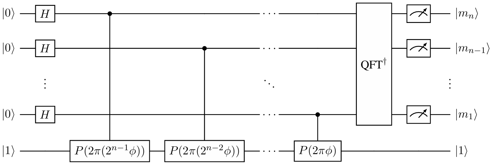
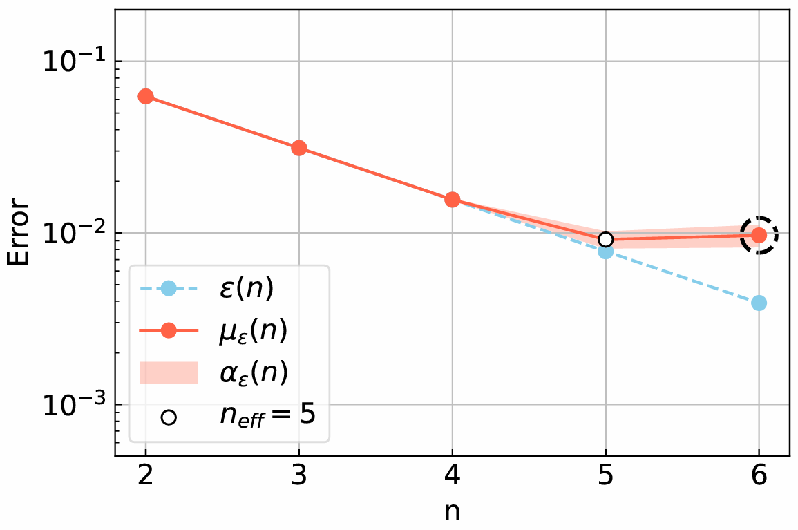

# The Effective Qubit Number

The effective qubit number $n_{\text{eff}}$ is a single number metric based on quantum phase estimation (QPE). It can be interpreted as the optimal amount of qubits a given device can use on a prefixed test implementation of QPE. It will be defined thoroughly below, but for a full discussion contained all the details, see my master's thesis (attached to the repo). 

## Contents
 - [Definition of The Effective Qubit Number](#definition-of-the-effective-qubit-number)
 - [How To Measure It (In Words)](#how-to-measure-it)
 - [Rules](#rules)
 - [How To Measure It (In Practice)](#documentation)

## Definition of The Effective Qubit Number
The prefixed test implementation of QPE is given below, where the unitary we are estimating eigenvalues of is a phase gate $P(2\pi\phi)$ with eigenstate $\ket{1}$ and eigenvalue $e^{i2\pi\phi}$. The top-most qubit is the least significant qubit and the inverse Fourier transform is without any swaps.



The outcome of this quantum circuit is a bitstring $m_1m_2\dots m_n$, from which an integer $m$ can be computed as $m = \sum_{i = 1}^{n}m_i2^{n-i}$. Running this quantum circuit $n_s$ times, yields an empirical probability distribution,

$\hat{p}(m, n_s) = \frac{n(m)}{n_s}$,

where $n(m)$ is the number of outputs equal to $m$. Given this distribution, define the phase estimate $\phi_{\text{est.}}(n)$ of the input phase $\phi$ as,

$\phi_{\text{est.}}(n) = \frac{1}{2^n} \underset{m}{\text{arg max}} \{ \hat{p}(m, n_s) \}$. 

In the absence of noise and in the limit $n_s \rightarrow \infty$, the phase estimate $\phi_{\text{est.}}(n)$ will be equal to the optimal phase estimate $\phi_{\text{opt.}}(n)$, i.e., the phase estimate on $n$ qubits that minimizes the distance $|\phi - \frac{m}{2^n}|$. We will refer to the distance $|\phi - \frac{m}{2^n}|$ as the numerical accuracy of QPE - it will be the main peformance metric used to define $n_{\text{eff}}$. To use it, a choice of representatives $\Phi \subset [0, 1]$ for the free variable $\phi \in [0, 1]$ must be made. I have chosen,

$\Phi = \{ \frac{1}{12}, \frac{1}{6}, \frac{1}{3}, \frac{5}{12}, \frac{7}{12}, \frac{2}{3}, \frac{5}{6}, \frac{11}{12} \}$,

which at firsthand seems rather arbitrary, but these representatives really represent all choices of $\phi \in [0, 1]$ in the following sense:

$\epsilon(n) := \int_0^1 |\phi - \phi_{\text{opt.}}(n)| \stackrel{\text{see thesis}}{=} \frac{3}{4|\Phi|} \sum_{\phi \in \Phi} |\phi - \phi_{\text{opt.}}(n)|.$

It is further argued in the thesis that $\phi_{\text{est.}}(n) = \phi_{\text{opt.}}(n)$ for $\phi \in \Phi$ with atleast $99.99\%$ probability, if we assume no noise and choose $n_s = 100$! This implies that under the same conditions,

$\epsilon_{\text{est.}}(n) := \frac{3}{4|\Phi|} \sum_{\phi \in \Phi} |\phi - \phi_{\text{est.}}(n)| = \frac{3}{4|\Phi|} \sum_{\phi \in \Phi} |\phi - \phi_{\text{pt.}}(n)| = \epsilon(n),$

with atleast $(99.99\%)^8 \approx 99.92\%$ probability. Deviations from this equality is therefore very unlikely to observe in the absence of noise. Furthermore, the presence of noise will tend to produce more uniformly distributed outcomes $\hat{p}(n, n_s=100)$, which implies larger errors $|\phi - \phi_{\text{est.}}(n)|$ and therefore deviations,

$\epsilon_{\text{est.}}(n) \neq \epsilon(n).$

Deviations $\epsilon_{\text{est.}}(n) \neq \epsilon(n)$ thus directly measure the imperfections of the quantum device and will be the base of the definition of $n_{\text{eff}}$. To get stable results $\epsilon_{\text{est.}}(n)$ is sampled $n_{\epsilon}$ times and averaged,

$\mu_{\epsilon}(n) = \frac{1}{n_{\epsilon}} \sum_{i = 1}^{n_{\epsilon}} \epsilon_{\text{est.}}^{i}(n) = \frac{3}{4|\Phi|n_{\epsilon}} \sum_{i = 1}^{n_{\epsilon}} \sum_{\phi \in \Phi} |\phi - \phi_{\text{est.}}(n)|.$

Note that $\mu_{\epsilon}(n) = \epsilon(n)$ in the absence of noise and in the limit $n_s \rightarrow \infty$, and that it in the presence of noise has a natural uncertainty, its standard error $\alpha_{\epsilon}(n)$. The deviation of this mean from the theoretically expected value,

$\Delta_{\text{loss}}(n) := \mu_{\epsilon}(n) - \epsilon(n)$

is the experimentally observed mean loss of numerical accuracy on $n$ qubits due to noise/imperfections. As we increase the number of qubits $n-1 \rightarrow n$ we expect a theoretical increase in numerical accuracy of,

$\delta_{\text{gain}}(n) = \epsilon(n-1) - \epsilon(n) \stackrel{\text{see thesis}}{=} \frac{1}{2^{n+1}} - \frac{1}{2^{n+2}} = \epsilon(n).$

If the experimental loss $\Delta_{\text{loss}}(n)$ is less than $\delta_{\text{gain}}(n)$ within its uncertainties $\alpha_{\epsilon}(n)$ (note: $\Delta_{\text{loss}}(n)$ and $\mu_{\epsilon}(n)$ differ by a constant, so their standard errors are equal), then the experiment on $n$ qubits is considered a success, if not, then its considered a failure. This can be denoted binarily as $S(n) = 1$ ($S(n) = 0$) for a success (failure). The effective qubit number $n_{\text{eff}}$ can be formulated as,

$n_{\text{eff}} = 1 + \sum_{n = 2}^{n'} S(n)$

where $n'$ is the first qubit count for which we get a failure. The effective qubit number $n_{\text{eff}}$ is therefore the largest number of qubits for which we get a success. In 'code/n_eff_example.ipynb' the effective qubit number has been measured for a very simple noise model. The data $\mu_{\epsilon}(n)$, $\alpha_{\epsilon}(n)$, and $\epsilon(n)$ used to compute $n_{\text{eff}}$ has been visualized below.



## How To Measure It (In Words)
In words, the proceedure to measure $n_{\text{eff}}$ is very simple:

1. Start with $n = 2$ and choose a fixed $n_{\epsilon}$. Typical values used in the thesis are $n_{\epsilon} \sim 50-100$.
2. Sample phase estimates $\phi_{\text{est.}}(n)$ based on empirical probability distributions $\hat{p}(m, n_s=100)$, for each $\phi \in \Phi$, $n_{\epsilon}$ times.
3. Compute mean experimental loss of numerical accuracy $\Delta_{\text{loss}}(n) \pm \alpha_{\epsilon}(n)$, and from that the success criterion $S(n)$.
4. If $S(n) = 1$ increase the qubit count $n \rightarrow n+1$ and repeat steps 2-3. If $S(n) = 0$ or if $n$ is the maximal amount of qubits on the device, let $n' = n$ and continue to step 5.
5. Return $n_{\text{eff}} = 1 + \sum_{n = 2}^{n'} S(n)$.

Now if you have limits on the ressources available, then this needs to be specified in the proceedure. An experiment on $n$ qubits takes,

$100 \cdot |\Phi| \cdot n_{\epsilon} \sim 100 \cdot 8 \cdot 75 = 60000$

calls to QPE. This might be a usefull quantity to incorporate when constraining the maximally allowed ressource usage.

## Rules
1. All optimization and transpiling tools are allowed when measuring $n_{\text{eff}}$, as long as they do not use information about the theoretically expected outcomes of the QPE algorithm. This information is not accessible in pratice, and should therefore not be used here.
2. All optimization tools used should be reported. During so ensures transparency between clients relying on the measured metric $n_{\text{eff}}$ to make decisions, and the providers measuring the metric $n_{\text{eff}}$.
3. The empirical distributions $\hat{p}(m, n_s=100)$ underlying the phase estimates $\phi_{\text{est.}}(n)$ should not be manipulated. This could alter the phase estimates $\phi_{\text{est.}}(n)$ and is considered cheating.

## How To Measure It (In Practice)
In the following I assume knowledge of an interval of qubit counts in which $n_{\text{eff}}$ is expected to be. The smaller this interval is the less computationally heavy the measurement will be. Such an interval could be proposed in a couple of ways:

1. Comparing low-level metrics and qubit topologies with other devices for which $n_{\text{eff}}$ has already been measured.
2. Measure $\epsilon_{\text{est.}}(n)$ for increasing $n$ until large deviations $\epsilon_{\text{est.}}(n) \neq \epsilon(n)$ are observed. It is expected that $n_{\text{eff}}$ lies right around the point where these deviations starts to occur. This knowledge can be used to make a proposal for such an interval.

After measuring $n_{\text{eff}}$, one might expect the data visually, in order to decide whether the proposed interval is reasonable.


If $n_{\text{eff}}$ is at the start of the interval, then smaller qubit counts needs to be considered. If $n_{\text{eff}}$ is at the end of the interval, then larger qubit counts needs to be considered. Alternatively, a safe, but computationally heavy, approach is to choose the largest possible interval $[2, n_{\text{max}}-1]$, where $n_{\text{max}}$ is the maximum number of qubits on the device.

Now assume knowledge of such an interval `ns` and fix `n_epsilon` (typically in the range $\sim 50-100$). The first thing to do is to construct the quantum circuits that need to run on hardware. This is done using the `get_circuits()` function in the 'code/n_eff.py' file.

```
qcs = get_circuits(ns, n_epsilon)
```

The quantum circuits is organized in a dictionary with keys `ns` and values `[circuit1, circuit2, ...]` being lists of circuits to run on hardware depending on the key value `n`. The next step is to run these circuits on hardware with 100 shots each. How this is done depends entirely on the cloud service used, and is thus up to the individual provider to implement properly. 

However obtained, the data should be a dictionary with same keys `ns` as `qcs` and values `[data1, data2, ...]` being lists of measurement outcomes `datai` obtained by running `circuiti` on hardware with `n` qubits and 100 shots. The measurement outcomes `datai` should also be a dictionary, but with keys being bitstring outcomes `m` with `n(m) != 0` and the values being `n(m)`. The rightmost bit in `m` should be the least significant one, i.e., the bit corresponding to the topmost qubit in the quantum circuits.

Given the measurement outcomes `data`, the effective qubit number can be computed using the `compute_n_eff()` function in the 'code/n_eff.py' file.

```
n_eff = compute_n_eff(data, display=True)
```

If `display = True`, then a plot similar to the one in the beginning of this section will be visualized. All this is written out in detail in the example notebook 'code/n_eff_example.ipynb' for a custom simple noisy simulator.