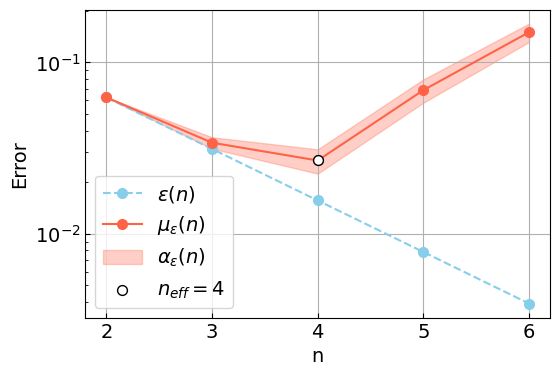

# The Effective Qubit Number

The effective qubit number $n_{\text{eff}}$ is a single number metric based on quantum phase estimation (QPE). It can be interpreted as the largest amount of qubits a given device can use on a prefixed test implementation of QPE, before more numerical accuracy is lost due to noise than is theoretically gained, when increasing the qubit count to $n_{\text{eff}} + 1$. It will be discussed in more depth below, but for a full discussion, see my master's thesis (attached to the repo). 

## Contents
 - [Definition of The Effective Qubit Number](#definition-of-the-effective-qubit-number)
 - [How To Measure It](#how-to-measure-it)
 - [Rules](#rules)
 - [Documentation](#documentation)

## Definition of The Effective Qubit Number
The prefixed test implementation of QPE is given below, where the unitary we are estimating eigenvalues of is a phase gate $P(2\pi\phi)$ with eigenstate $\ket{1}$ and eigenvalue $e^{i2\pi\phi}$. The top-most qubit is the least significant qubit and the inverse Fourier transform is without any swaps.

Each run of the circuit above results in an integer $m$ computing from the binary output string $m_1m_2\dots m_n$ with $m_n$ the least significant bit. Repeating this $n_s$ times yields an empirical probability distribution,

$\hat{p}(m, n_s) = \frac{n(m)}{n_s}$,

where $n(m)$ is the number of outputs equal to $m$. Given this data, we define the phase estimate $\phi_{\text{est.}}$ of the input phase $\phi$ as follows,

$\phi_{\text{est.}} = \frac{1}{2^n} \underset{m}{\text{arg max}} \{ \hat{p}(m, n_s) \}$. 

This will in the absence of noise and in the limit $n_s \rightarrow \infty$ always be equal to the optimal phase estimate $\phi_{\text{opt.}}(n)$, i.e., the phase estimate on $n$ qubits that minimizes the distance $|\phi - \frac{m}{2^n}|$. We will refer to this distance as the numerical accuracy of QPE - it will be the main peformance metric used to define $n_{\text{eff}}$. To use this performance metric, a choice of representatives is necessary. I have chosen,

$\Phi = \{ \frac{1}{12}, \frac{1}{6}, \frac{1}{3}, \frac{5}{12}, \frac{7}{12}, \frac{2}{3}, \frac{5}{6}, \frac{11}{12} \}$,

which ensures that,

$\epsilon(n) := \int_0^1 |\phi - \phi_{\text{opt.}}(n)| \stackrel{\text{see thesis}}{=} \frac{3}{4|\Phi|} \sum_{\phi \in \Phi} |\phi - \phi_{\text{opt.}}(n)|.$

The phases $\Phi$ therefore represent all possible choices of the free variable $\phi$. For these representatives it turns out that $\phi_{\text{est.}}(n) = \phi_{\text{opt.}}(n)$ with atleast $99.99\%$ probability, if we assume no noise and choose $n_s = 100$. This implies that under the same conditions,

$\epsilon_{\text{est.}}(n) := \frac{3}{4|\Phi|} \sum_{\phi \in \Phi} |\phi - \phi_{\text{est.}}(n)| = \epsilon(n),$

with atleast $99.92\%$ probability. Deviations from this equality is thus very unlikely to observe in the absence of noise. Furthermore, the presence of noise will tend to produce more uniformly distributed outcomes $\hat{p}(n, n_s=100)$, which will tend to produce larger errors $|\phi - \phi_{\text{est.}}(n)|$ and thus deviations,

$\epsilon_{\text{est.}}(n) \neq \epsilon(n).$

Such deviations thus directly measure the presence of quantum mechanical noise in the system and will be the base of the definition of $n_{\text{eff}}$. To get stable results $\epsilon_{\text{est.}}(n)$ is sampled $n_{\epsilon}$ times and averaged,

$\mu_{\epsilon}(n) = \frac{1}{n_{\epsilon}} \sum_{i = 1}^{n_{\epsilon}} \epsilon_{\text{est.}}^{i}(n) = \frac{3}{4|\Phi|n_{\epsilon}} \sum_{i = 1}^{n_{\epsilon}} \sum_{\phi \in \Phi} |\phi - \phi_{\text{est.}}(n)|.$

A natural uncertainty on $\mu_{\epsilon}(n)$ is the standard error $\alpha_{\epsilon}(n)$. The deviation of this mean from the theoretically expected value,

$\Delta_{\text{loss}}(n) := \mu_{\epsilon}(n) - \epsilon(n)$

is the experimentally observed mean loss of numerical accuracy due to noise at $n$ qubits. As we increase the number of qubits $n-1 \rightarrow n$ we expect a theoretical increase in numerical accuracy of,

$\delta_{\text{gain}}(n) = \epsilon(n-1) - \epsilon(n) \stackrel{\text{see thesis}}{=} \frac{1}{2^{n+1}} - \frac{1}{2^{n+2}} = \epsilon(n).$

If the experimental loss $\Delta_{\text{loss}}(n)$ is less than $\delta_{\text{gain}}(n)$ within its uncertainties $\alpha_{\epsilon}(n)$ (note: $\Delta_{\text{loss}}(n)$ and $\mu_{\epsilon}(n)$ differ by a constant, so their standard errors coincides), then the experiment on $n$ qubits is considered a success, if not, then its considered a failure. This can be denoted binarily as $S(n) = 1$ ($S(n) = 0$) for a success (failure). The effective qubit number $n_{\text{eff}}$ can be formulated as,

$n_{\text{eff}} = 1 + \sum_{n = 2}^{n'} S(n)$

where $n'$ is the first qubit count for which we get a failure. In words, $n_{\text{eff}}$ is the largest number of qubits for which we get a success. This quantity has been measured for a custom noise model (see thesis) resulting in the illustration below, containing all the relevant quantities defined above.

## How To Measure It
The general proceedure to measure $n_{\text{eff}}$ is outlined below. If you have limits on the ressources available, this needs to be specified in the proceedure. Each experiment on a given number of qubits $n$ takes

$100 \cdot |\Phi| \cdot n_{\epsilon} \sim 100 \cdot 8 \cdot 75 = 60000$

calls to QPE. This might be a usefull quantity to incorporate when constraining the maximally allowed ressource usage.

1. Start with $n = 2$ and choose a fixed $n_{\epsilon}$. Typical values used in the thesis are $n_{\epsilon} \sim 50-100$.
2. Sample phase estimates $\phi_{\text{est.}}(n)$ based on empirical probability distributions $\hat{p}(m, n_s=100)$ for each $\phi \in \Phi$ a given amount of times $n_{\epsilon}$. This number determines the certainty with which we can learn $\mu_{\epsilon}(n)$.
3. Compute mean experimental loss of numerical accuracy $\Delta_{\text{loss}}(n) \pm \alpha_{\epsilon}(n)$.
4. If $S(n) = 1$ increase the qubit count $n \rightarrow n+1$ and repeat steps 2-3. If $S(n) = 0$ or if $n$ is the maximal amount of qubits on the device, let $n' = n$ and continue to step 5.
5. Return $n_{\text{eff}} = 1 + \sum_{n = 2}^{n'} S(n)$.

(Explain how the code should be used)

## Rules
1. All optimization and transpiling tools are allowed when measuring $n_{\text{eff}}$, as long as these do not use information about the theoretically expected outcomes of the QPE algorithm. This information is not accessible in pratice, and should therefore not be used here.
2. All optimization tools used should be reported in order to ensure transparency between those using the measured metric $n_{\text{eff}}$ to make decisions, and those performing the measurement itself.
3. The empirical distributions $\hat{p}(m, n_s=100)$ underlying the phase estimates $\phi_{\text{est.}}(n)$ should not be manipulated. This could alter the phase estimates $\phi_{\text{est.}}(n)$ and is considered cheating.

## Documentation
...